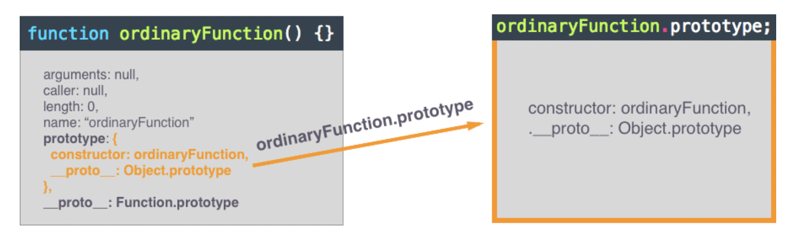

# Constructor function

Constructor functions achieve the same goal as factory functions, they create and return an object (an 'instance'). Constructor functions use different syntax compared to factory functions. Here is an example of a constructor function:

```
function FourWheeler(fwType) {
    this.numberOfWheels = 4
    this.type = fwType
}

let car = new FourWheeler('car')
```

Constructor functions are ordinary functions invoked with the new operator and return an object ‘instance'.

When the new operator is used to invoke a function, it creates an object and returns the object implicitly from the function. The object is "implicitly" returned meaning the return keyword isn't necessary.

When the new operator invokes a constructor function, the this keyword within the constructor function's code block references the object new creates. The this keyword always references an object.

## Function.prototype

The Function.prototype property of a constructor function gives access to adding key / value pairs to the prototype chain of the instances that the constructor function creates.  
In javascript, a function is also a type of object. But if you console.log a function, besides the [[Prototype]] property, it also get a `prototype` property which is a special property.

By default, the .prototype property is assigned an object. The object assigned to the .prototype property always has two properties:

- constructor
- the internal [[Prototype]] of the object

```
function ordinaryFunction () {

}
```

The .**proto** a.k.a. the internal [[Prototype]] property should not be a surprise, all objects have an internal [[Prototype]]. The functionality of the internal [[Prototype]] is the next step (or link) in the prototype chain. Keep in mind, the ordinaryFunction object has an internal [[Prototype]] AND the object assigned to the .prototype property has its own internal [[Prototype]] since it is a separate object, this is illustrated in the diagram below.

As mentioned, the .prototype object has two properties, the second property is the constructor property. The constructor property is assigned the function object the .prototype object belongs to. Since the constructor property is assigned an object, technically it is a method. Let's take a look at a visual, it is important to have a strong understanding of object data types and their behavior when assigned to variables (the concept is "assign by reference").


1. The orange arrow points to an enlarged view of the ordinaryFunction.prototype object.
2. The blue arrow points from the constructor property to the ordinaryFunction. The takeaway is the blue arrow which represents that the constructor property is assigned a reference to the ordinaryFunc function object.

### Attaching methods to Function.prototype

```
function FourWheeler(fwType) {
    this.numberOfWheels = 4,
    this.type = fwType
}

let car = new FourWheeler('car')
```

When the `new FourWheeler` code block is executed, what is happening inside the execution of the `FourWheeler` function when called with `new` is:

```
function FourWheeler(fwType) {
    // creates an object 'this'
    // this = Object.create(FourWheeler.prototype)
    this.numberOfWheels = 4,
    this.type = fwType
    // implicitly returns the instance 'this'
}
```

Now when you create a function on FourWheeler.prototype

```
FourWheeler.prototype.honk = function() {
    console.log('honk')
}
```

now you can call it from car

```
car.honk()
```

here `car.hasOwnProperty('type')` returns `true`, but `car.hasOwnProperty('honk')` returns `false`. That is is how Function.prototype is working

### Function.prototype access to `this`

the prototype has access to `this` for the `new` objects

1. `console.log(car.type)` prints `car`
2. now, after the following code block

```
FourWheeler.prototype.changeType = function(newType) {
    this.type = newType
}

car.changeType('Fast car')
```

3. `console.log(car.type)` will print `Fast car`
